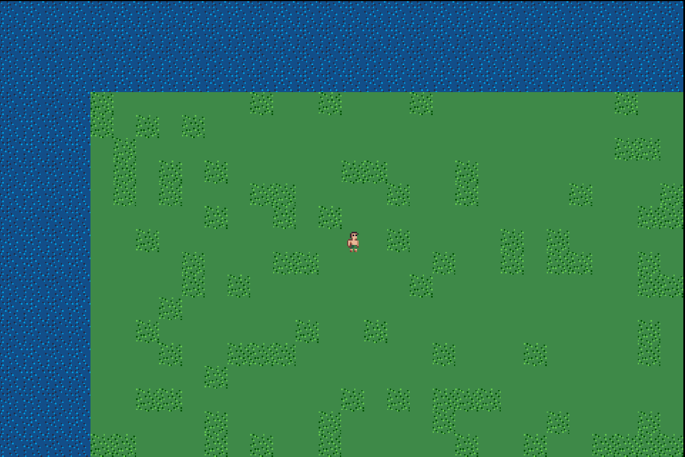

# The Kingdom of Luna

The Kingdom of Luna is a turn based 8 bit style RPG entire written in pure Javascript. Yes, no frameworks, no third-party game engines.

## Development

The game is in the first stages of development... and currently there are not a lot to show you :(

You can play around in a very simple world using the keyboard arrow keys, mobile is not supported yet.

This is the first glimpse of the game:

