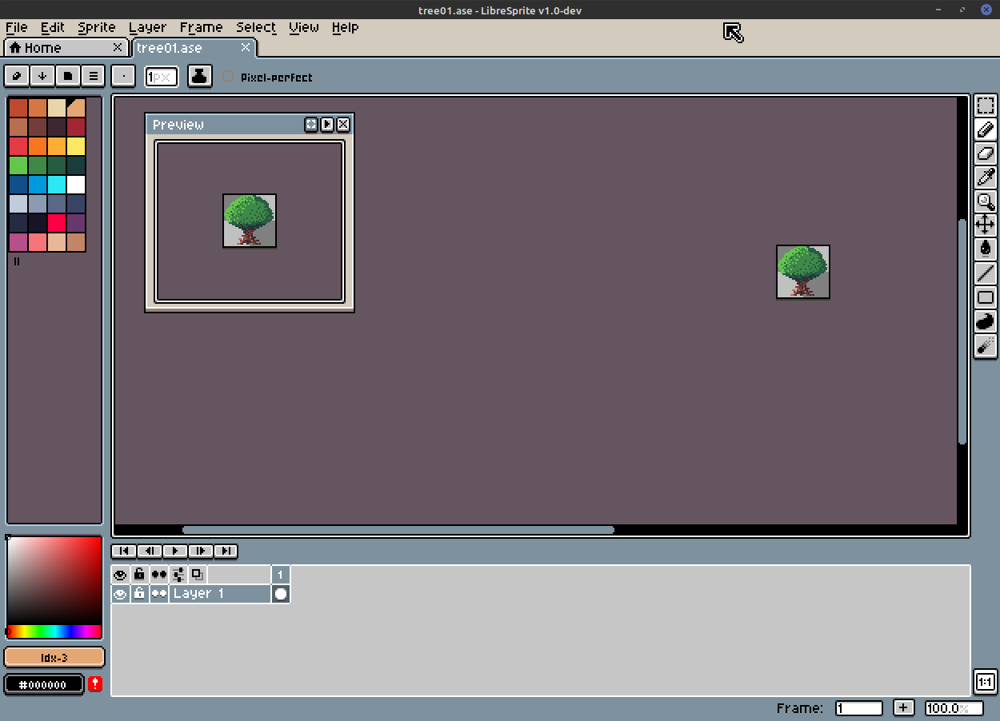

# The Kingdom of Luna

The Kingdom of Luna is a turn based 8 bit style RPG entire written in pure Javascript. Yes, no frameworks, no third-party game engines.

## Development

The game is in the first stages of development... and currently there are not a lot to show you :(

You can play around in a very simple world using the keyboard arrow keys, mobile or gamepads are not supported yet.

This is the first glimpse of the game:


https://www.youtube.com/watch?v=be9ax1X3o0A

## Implemented features

* Draw tiles and tiles animations
* Draw player
* Draw multiple layers (terrain, background and foreground)
* Draw map from specification JSON
* Move player using keyboard
* Terrain and Sprites collisions

## How to run the game

The first step is to clone the repository or download the source code to your computer and install the NodeJS if you haven't already installed it on your computer.

To install the game dependencies you must open the computer terminal and run the command ```npm install``` from the game directory.

To run the game you must use the command ```npm start```.

## Sprite editor

To create the game sprites I'm using the [LibreSprite](https://github.com/LibreSprite/LibreSprite), an excellent open source fork of the Aseprite sprite editor.


